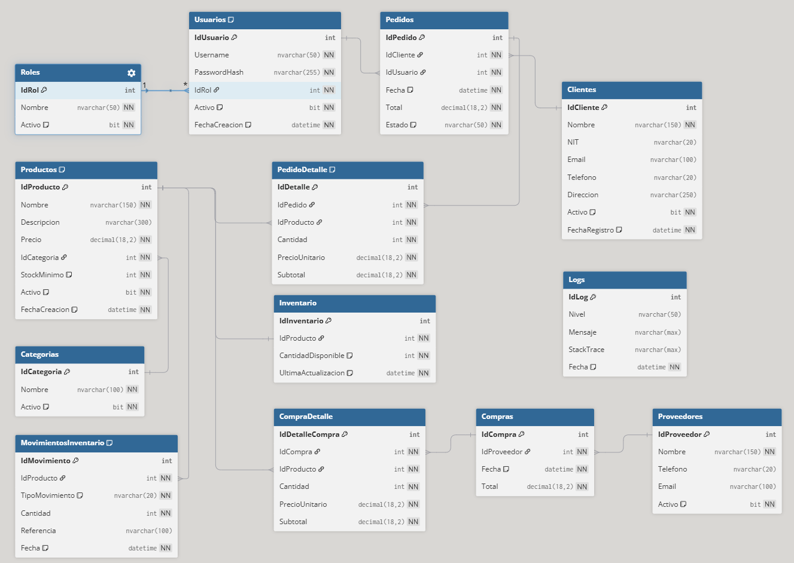

# Base de datos ERPZapateria

Este directorio contiene los scripts de SQL Server para el esquema, relaciones e items logicos del ERP.

## Contenido

- 01_Schema.sql: crea la base de datos, tablas, indices y relaciones.
- 02_StoredProcedures.sql: define tipos y procedimientos almacenados.

## Orden de ejecucion

1. Ejecutar 01_Schema.sql para crear la base y el esquema.
2. Ejecutar 02_StoredProcedures.sql para crear tipos y procedimientos.

## Entidades principales

- Seguridad: Roles y Usuarios.
- Ventas: Clientes, Pedidos, PedidoDetalle.
- Inventario: Categorias, Productos, Inventario, MovimientosInventario.
- Compras: Proveedores, Compras, CompraDetalle.
- Auditoria: Logs.

## Diagrama ER

## Notas

- No se incluyen datos iniciales por ahora.
- El esquema esta pensado para SQL Server.

## Documentacion adicional

- [README General](../README.md)
- [Backend API](../Backend/README.md)
- [Application Layer](../Backend/ERPZapateria.Application/README.md)
- [Frontend](../Frontend/README.md)
